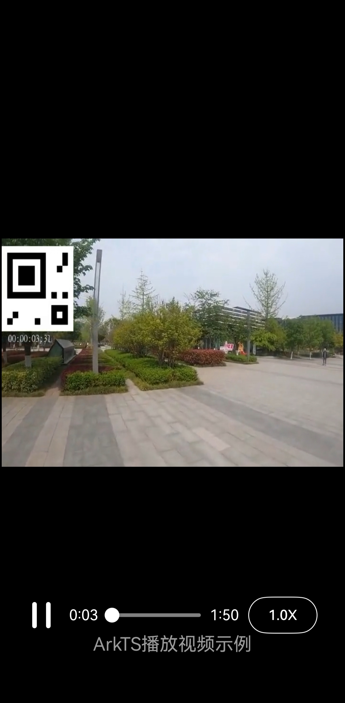

# AVPlayerArkTSVideo

## 介绍

本示例为媒体->Media Kit(媒体服务)->[使用AVPlayer播放视频(ArkTS)](https://gitee.com/openharmony/docs/blob/master/zh-cn/application-dev/media/media/video-playback.md)的配套示例工程。 

本示例展示了如何使用AVPlayer组件完整地播放一个视频。

## 效果预览

| 播放效果                                      | 
| -------------------------------------------- | 



## 工程目录

```
AVPlayerArkTSVideo
entry/src/main/ets/
└── pages
    └── Index.ets (播放界面)
entry/src/main/resources/
├── base
│   ├── element
│   │   ├── color.json
│   │   ├── float.json
│   │   └── string.json
│   └── media
│       ├── ic_video_play.svg  (播放键图片资源)
│       └── ic_video_pause.svg (暂停键图片资源)
└── rawfile
    └── test1.mp4 （视频资源）
entry/src/ohosTest/ets/
└── test
    ├── Ability.test.ets (UI测试代码)
    └── List.test.ets (测试套件列表)
```

## 相关权限

不涉及

## 依赖

不涉及

## 约束和限制

1. 本示例支持标准系统上运行，支持设备：RK3568;

2. 本示例支持API15版本SDK，版本号：5.0.3.135;
   
3. 本示例已支持使DevEco Studio 5.0.3 Release (构建版本：5.0.8.300，构建 2025年3月19日)编译运行

## 下载

如需单独下载本工程，执行如下命令：

```
git init
git config core.sparsecheckout true
echo code/DocsSample/Media/AVPlayer/AVPlayerArkTSVideo/ > .git/info/sparse-checkout
git remote add origin https://gitee.com/openharmony/applications_app_samples.git
git pull origin master
```